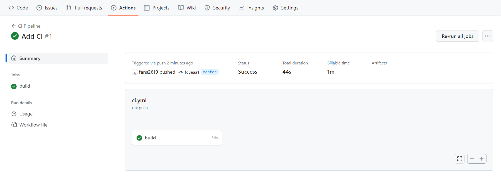
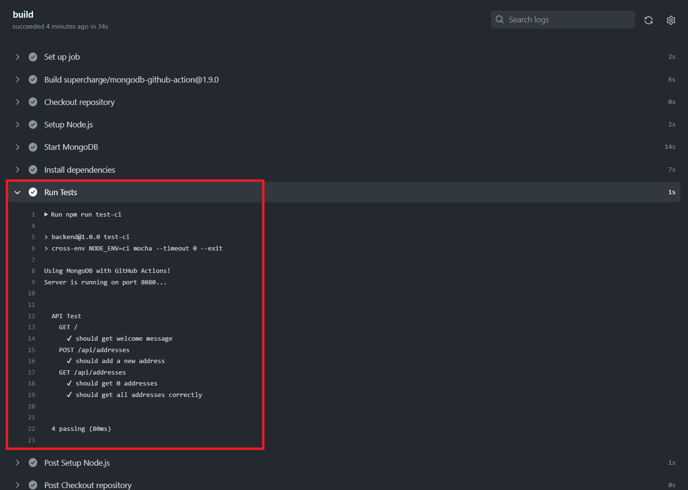

# CS3219 SE Toolbox - CI with GitHub Actions
The CS3219 SE Toolbox is a collection of guides and resources to help you get started with the various tools and technologies used CS3219 - Software Engineering Principles and Patterns. 

This guide will walk you through the process of setting up a GitHub Actions workflow for Continuous Integration (CI) for a Node.js and Express backend application.
## Learning Objectives

Welcome to this guide on Continuous Integration (CI) with GitHub Actions. In this guide, you will learn:

- How to set up a GitHub Actions workflow that automates build and test processes for a Node.js and Express backend application.

## Prerequisites

Before starting, ensure that you have the following:

1. Basic understanding of Git and version control
2. A GitHub account
3. Familiarity with the concepts of CI
4. Having Node.js and npm installed on your local machine is recommended. You can visit this [page](https://docs.npmjs.com/downloading-and-installing-node-js-and-npm) for installation instructions. You can still proceed with this guide without them installed; however, some steps in the following sections may need to be skipped.

## Initial Setup

1. Fork/clone the repository [https://github.com/TIC3001/TIC3001-CI-GH-Actions-Tutorial-Code](https://github.com/TIC3001/TIC3001-CI-GH-Actions-Tutorial-Code) to your device. 

   > ℹ️ About the project: The repository contains the backend code of an address book application, one that is similar to what you have seen in CS2103/T or CS2113/T but developed in JavaScript. The backend is equipped with basic functionalities, including the ability to add, retrieve, edit, and delete information, by connecting to MongoDB Atlas – a cloud database. Furthermore, the `test` directory includes a set of integration tests. You will see that they are automatically executed in the CI workflow later.

   💡You may skip steps 2 & 3 if you do not have Node.js or npm installed.

2. Install all dependencies by running `npm install` in the project directory.

3. To ensure everything is set up correctly, run `npm test`. All tests should pass in the local environment since they are using a mock database.

## Setting Up GitHub Actions for CI

Now, let's set up a GitHub Actions workflow for Continuous Integration (CI). The workflow will be triggered when changes are pushed to the `master` branch.
1. In the repo you just forked/cloned, create a `.github` directory at the root of this project

2. Inside the `.github` directory, create another directory named `workflows`

3. Inside the `workflows` directory, create a new file named `ci.yml`

4. Add the following code inside `ci.yml`. We will see what this code means shortly:

   ```yaml
   name: CI Pipeline
   
   on:
     push:
       branches:
         - master
   
   jobs:
     build:
       runs-on: ubuntu-latest
   
       steps:
         - name: Checkout repository
           uses: actions/checkout@v3
   
         - name: Setup Node.js
           uses: actions/setup-node@v3
           with:
             node-version: '18.x'
             cache: 'npm'
   
         - name: Start MongoDB
           uses: supercharge/mongodb-github-action@1.9.0
           with:
             mongodb-version: '6.0'
   
         - name: Install dependencies
           run: npm ci
   
         - name: Run Tests
           run: npm run test-ci
   ```

<br>

> ```yaml
> name: CI Pipeline
> 
> on:
>   push:
>     branches:
>       - master
> ```

**`name`**: This sets the name of the workflow. In our case, it’s "CI Pipeline".

**`on`**: This specifies the events that trigger the workflow. We use the `push` event on the `master` branch. So, whenever code is pushed to the `master` branch, this workflow will be triggered. You can explore other events that can trigger a workflow e.g., a pull request etc.

> ```yaml
> jobs:
>   build:
>     runs-on: ubuntu-latest
> 
>     steps:
>       - name: Checkout repository
>         uses: actions/checkout@v3
> 
>       - name: Setup Node.js
>         uses: actions/setup-node@v3
>         with:
>           node-version: '18.x'
>           cache: 'npm'
> 
>       - name: Start MongoDB
>         uses: supercharge/mongodb-github-action@1.9.0
>         with:
>           mongodb-version: '6.0'
> ```

**`jobs`**: This section defines one or more jobs for the workflow. Each job represents a set of steps that run on the same runner. In our case, we have a single job named "build".

**`runs-on`**: This specifies the operating system on which the job will run. We use `ubuntu-latest`, which represents the latest version of Ubuntu available on GitHub Actions.

**`steps`**: This section contains a list of steps to be executed in the job. Steps are the individual units of work that run commands or actions.

**`name`**: Each step is given a name to make the output more descriptive and easier to understand.

**`uses`**: This keyword is used to specify an action that should be executed as part of the step. For example, we use the `actions/checkout` to check out the code from the repository and `actions/setup-node` to set up Node.js on the runner.

We also utilize the `supercharge/mongodb-github-action` to set up a running MongoDB instance in the CI environment. This enables us to perform integration tests and ensure that our application interacts correctly with the database during the test process.

> ```yaml
>       - name: Install dependencies
>         run: npm ci
> 
>       - name: Run Tests
>         run: npm run test-ci
> ```

In these steps, we install the project dependencies using `npm ci`, a standard Node.js command, and then run the tests using `npm run test-ci`. The definition for the `test-ci` command can be found inside the `package.json` file.

### 📖 **Observe CI with GitHub Actions**
A GitHub Actions workflow has been established to automate the build and test procedures, configured to trigger when changes are pushed to the `master` branch. To observe this, make sure you have an existing remote repository set up on GitHub, or create a new one if you haven't already. Once your repository is ready, commit and push your changes to the `master` branch. As you do this, observe how GitHub Actions automatically triggers and executes the CI (Continuous Integration) workflow. You can then check the workflow's status and inspect the test results to verify if the tests have passed successfully.





<br>

🎉Congratulations on successfully following this CI with GitHub Actions guide!

## Use of AI Acknowledgement
This guide's outline was generated with the help of ChatGPT. 

## References
Here are the resources that were used to create this guide:

GitHub Docs - Building and testing Node.js: https://docs.github.com/en/actions/automating-builds-and-tests/building-and-testing-nodejs

MongoDB in GitHub Actions: https://github.com/marketplace/actions/mongodb-in-github-actions

## Other Resources

[Using a matrix for your jobs](https://docs.github.com/en/actions/using-jobs/using-a-matrix-for-your-jobs)
